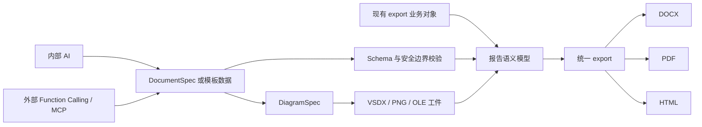

# Omni Office

Omni Office 是一个面向 Java 应用的 Office 文档生成与报告编排项目。项目在 Aspose Words、Aspose Diagram 之上提供了更稳定的领域模型、Builder API 和报告模块机制，使业务代码不需要直接操作 Word 游标、段落节点或底层 OOXML。

当前项目同时支持三类入口：现有强类型 `export` 业务报告、内部 AI 生成，以及面向外部模型的
Function Calling/MCP 服务。三类入口最终都收敛到受校验的报告语义模型和统一导出链路，输出
DOCX、PDF 或单文件 HTML；新增能力不会替换或隐式回退到现有 export 业务模板。

> 快速了解当前项目已经实现的功能、适用场景和可运行代码，请查看
> **[功能总览与针对性示例](docs/project-capabilities-and-examples.md)**。
>
> 长期使用 Aspose.Words 的项目可直接参考
> **[Aspose.Words 到 omni-office 迁移对照指南](docs/aspose-words-migration-guide.md)**。

## 核心特性

- 使用强类型业务对象实现报告模块，不需要把所有模块数据硬编码为 `String`。
- 提供可组合报告定义、对象型文本模块和类型化导出门面的公共父类。
- 八个评估分析模块可任意选择、排序和组合。
- 支持默认封面和实现 `ReportCoverTemplate` 的动态封面。
- 内置“文档修改记录”表格封面模板，支持动态记录和空白填写行。
- 封面、目录、业务正文使用三个独立 Word Section。
- 启用目录时，目录后直接衔接第一个业务模块，不插入重复主标题或隐式基础信息表。
- 目录页使用大写罗马数字 `I、II、III...`，业务正文重新从阿拉伯数字 `1` 开始。
- 页脚默认仅显示页码，也可选择“第 N 页”格式。
- 业务正文页眉可选，不设置时不会创建页眉。
- 支持业务实现公开的 `StyleProfile` 接口，自定义整套字体、字号、行距、段距和表格样式。
- 支持 Word 原生多级标题编号、目录域、页码域、题注和交叉引用。
- 支持段落、列表、表格、图片、Visio 预览、分页和类设计表格。
- 支持 DOCX、PDF 和单文件 HTML 输出，并使用临时文件保证文件导出的原子性。
- 提供 SVG 用例图、流程图、ER 图以及 VSDX 图形输出能力。
- 提供模块计划、条件判断、依赖校验、语义文档校验和阶段化异常信息。
- 提供版本化 `DocumentSpec`、`DiagramSpec` 和 `DocumentTemplate` 协议及 JSON Schema。
- 支持内部 AI 自由生成 DocumentSpec，或只填充模板业务数据；两种模式边界独立。
- Function Calling、MCP stdio 与 MCP Streamable HTTP 复用同一个外部工具业务门面。
- 支持 API Key/JWT、Origin、会话、限流、多租户、受控下载、审计及异步 MCP Tasks。
- 支持模板审核发布、Schema 兼容迁移、AI 评测/人工审批和产物安全生命周期。

## 端到端链路



AI 输出始终按不受信输入处理。外部协议层只能调用受控工具，不能绕过 DocumentTemplate、
DocumentSpec、DiagramSpec、工件目录和统一 export 的校验。

## 技术栈

| 技术 | 版本/用途 |
| --- | --- |
| Java | 源码兼容级别为 Java 11；由于当前 Aspose Words 使用 `jdk17` classifier，运行时推荐 JDK 17 或更高版本 |
| Maven | 项目构建、依赖描述和测试执行 |
| Aspose Words for Java | DOCX 创建、Word 域、目录、页眉页脚、分节和 PDF 转换 |
| Aspose Diagram for Java | VSDX 图形生成与编辑 |
| Jackson | 严格 JSON 编解码、协议消息和持久化元数据 |
| NetworkNT JSON Schema Validator | 模板业务数据和协议 Schema 校验 |
| JDK HttpServer/HttpClient | 独立 MCP HTTP 服务、Ollama 与客户端适配 |
| PostgreSQL/HikariCP | 多实例任务、幂等键、事务型 Webhook Outbox 与连接池；表结构由人工维护 |
| AWS SDK for Java 2.x | S3、MinIO 及兼容对象存储适配 |
| JUnit Jupiter | 单元测试和文档结构回归测试，版本 5.10.2 |
| SVG/XML | 不依赖 Word 的用例图、流程图和 ER 图输出 |

## 项目结构

```text
src/main/java/cn/bugstack
├── application             # DocumentSpec、模板、AI、外部工具、HTTP 与治理应用层
├── protocol                # 对外 DocumentSpec/DiagramSpec 协议对象
├── export
│   ├── api                 # 导出请求、结果、格式和异常
│   ├── composable          # 可组合报告配置契约与定义父类
│   ├── core                # 导出生命周期、计划、校验和编排
│   ├── definition          # 报告蓝图、布局、模块槽位和封面模板协议
│   ├── document            # 与 Word 实现无关的报告语义模型
│   ├── docx                # 语义文档到 DOCX/PDF/HTML 的编译适配器
│   ├── module              # 报告模块、注册表、条件和强类型数据上下文
│   ├── template/cover      # 可直接用于业务的正式封面模板
│   └── example             # 完整报告和可组合模块示例
└── office
    ├── docx                # DOCX 组件树、Builder、样式、校验和 Aspose 渲染器
    └── diagram             # SVG/VSDX 图形定义与渲染器

src/main/resources
├── document-spec/1.0       # Schema、能力清单和示例
├── diagram-spec/1.0        # 图协议 Schema、能力清单和示例
├── document-template/1.0   # 模板协议、示例模板和示例数据
├── internal-ai/1.0         # AI 能力清单和 Ollama 演示模板
├── external-tools/1.0      # Function Calling/MCP 工具能力清单
└── omni-service/1.0        # HTTP 服务能力清单
```

## 设计思路

### 1. 报告语义与 Word 实现分离

业务模块只创建 `ReportSection`、`ReportParagraph`、`ReportTable` 等语义元素，不直接依赖 Aspose。`DocxReportCompiler` 负责把语义树编译为内部 DOCX 组件树，最后由 `AsposeDocxRenderer` 写入真实文件。

```mermaid
flowchart LR
    A[业务入参] --> B[ReportDefinition]
    B --> C[ReportBlueprint]
    C --> D[ReportPlanner]
    D --> E[ReportModule]
    E --> F[ReportDocument 语义树]
    F --> G[ReportDocumentValidator]
    G --> H[DocxReportCompiler]
    H --> I[DocxDocument 组件树]
    I --> J[AsposeDocxRenderer]
    J --> K[DOCX / PDF / HTML]
```



这种边界让业务模块可以被独立测试，也让 HTML 等目标格式复用相同业务组装和校验逻辑。

### 2. 定义、模块和导出职责分离

`AbstractComposableReportDefinition<I>` 统一处理封面、目录、页眉页脚和动态模块顺序，具体报告
仍通过 `contributeData(...)` 装配模块数据。`AbstractTextReportModule<T>` 只简化“从业务对象取出
一段文本”的模块，复杂模块仍直接继承 `AbstractReportModule<T>`。`AbstractReportExportFacade<I>`
负责固定报告定义和模块注册表，定义对象本身不承担导出职责。

### 3. 模块采用注册表和策略模式

每个报告模块都是独立的 `AbstractReportModule<T>` 实现，并拥有自己的数据类型、数据键、模块编码和章节标题。`ReportModuleRegistry` 负责注册与查找模块，`ReportPlanner` 按蓝图顺序解析依赖、条件和最终执行计划。

模块是否导出由入参决定，调用方添加模块的顺序就是最终 Word 章节顺序。重复模块和空模块组合会在构建阶段被拒绝。

### 4. 文档内部使用 Composite + Builder

`DocumentNode`、`SectionNode`、`ParagraphNode`、`TableNode` 和各种 Inline 节点构成内部组件树。调用方使用 `DocxDocument`、`SectionBuilder`、`TableBuilder` 等 Builder 创建内容，渲染器统一处理节点遍历、游标位置和样式恢复。

### 5. 封面使用可插拔模板

`ReportCoverTemplate` 返回与目标格式无关的有序语义元素。默认封面继续使用标准文档名称、项目名称和版本布局；调用方也可以替换为表格、段落或自定义组合。

动态封面位于目录之前，并拥有独立 Section。模板内容不会自动加入目录，也不会被正文标题编号影响。

### 6. 分节和页码独立控制

可组合报告的默认结构为：

```text
Section 1：封面，无页眉页脚
Section 2：目录，独立页脚，页码从 I 开始
Section 3：业务模块，可选页眉，页码重新从 1 开始
```

Section 3 的首个正文元素及其样式由第一个业务模块决定，框架不要求它必须是 `Heading 1`。报告名称应放在封面，报告编号、
编制信息等内容应放在封面模板或显式的“基本信息”业务模块，不应作为框架生成的内容夹在目录与正文之间。
即使历史配置同时设置了 `tableOfContentsDepth` 和 `bodyTitleEnabled=true`，编译器也会优先保证该结构约束。
只有未配置目录时，`bodyTitleEnabled=true` 才会在正文前输出报告主标题，并兼容输出已显式提供的
`ReportBasicInfo`。

目录和正文页脚会断开“链接到前一节”。正文内部后续增加 Section 时只在第一个正文 Section 重启页码，避免每个章节都重新回到 1。

### 7. 可扩展编译边界

内置编译器支持常用语义元素。业务如果新增自定义 `ReportElement`，可以注册 `ReportElementCompiler<E>`，而不需要修改所有报告模块或直接侵入 Aspose 渲染器。

## 环境准备

### 前置要求

- JDK 17 或更高版本。
- Maven 3.6.3 或更高版本。
- Aspose Words 26.6 和 Aspose Diagram 26.6 对应 JAR。

### 本地依赖

`lib/` 已被 Git 忽略，不会提交 Aspose 二进制文件。克隆项目后需要准备以下文件：

```text
lib/
├── aspose-words-26.6-jdk17.jar
└── aspose-diagram-26.6.jar
```

`scripts/bootstrap-aspose.sh` 只检查并保留已有文件，绝不会从公共仓库覆盖本地 JAR。GitHub Actions 需要配置
`ASPOSE_WORDS_JAR_URL`、`ASPOSE_DIAGRAM_JAR_URL` 两个私有制品地址 Secret，并按需配置
`ASPOSE_ARTIFACT_TOKEN`；脚本仅在文件完全不存在时下载，然后运行与发布前一致的
`scripts/release-check.sh` 质量门禁。

当前 `pom.xml` 使用 `systemPath` 引用这两个文件，因此缺少 JAR 时 Maven 无法编译。生产项目可以根据自己的制品仓库规范，将依赖安装到私服并把 `system` 依赖改为普通 Maven 依赖。

Aspose License 不应提交到代码仓库。可以通过环境变量或 JVM 系统属性指定：

```bash
export ASPOSE_WORDS_LICENSE_PATH=/absolute/path/Aspose.Words.Java.lic
```

或：

```bash
java -Daspose.words.license.path=/absolute/path/Aspose.Words.Java.lic ...
```

未配置 License 时会按照 Aspose 的评估模式运行。

## 快速开始

### 使用可组合报告

先按最终章节顺序组装对象型模块数据，再交给独立的导出门面：

```java
ComposableReportModuleModel modules = ComposableReportModuleModel.builder()
        .module(new AssessmentScenarioConstructionModuleData("评估场景构设正文。"))
        .module(new ImpactAnalysisModuleData("影响分析正文。"))
        .build();

ComposableReportInput input = ComposableReportInput.builder(modules)
        .preparedBy("评估分析组")
        .build();

ComposableTextReportExporter exporter = new ComposableTextReportExporter();
exporter.export(input, Path.of("target", "assessment-report.docx"));

// HTTP 下载场景
byte[] content = exporter.exportToBytes(input);
```

`ComposableReportInput` 实现公共的 `ComposableReportConfiguration`；
`ComposableTextReportDefinition` 继承公共定义父类，仅保留 `contributeData(...)`；
`ComposableTextReportExporter` 继承公共导出门面并注册当前报告支持的 8 个模块。

### 使用 DocumentSpec 动态生成文档

不需要预定义业务章节时，可以使用 `DocumentSpec` 描述章节、段落、列表、表格、图片、原生图表、
子章节和分页符，再通过动态导出器复用现有语义校验及 DOCX/PDF/HTML 渲染链路：

```java
DocumentSpec spec = new DocumentSpec();
spec.setMetadata(new DocumentMetadataSpec("系统评估报告"));
spec.addSection(new SectionSpec("评估背景")
        .addBlock(new ParagraphBlockSpec(
                "本报告围绕系统能力、任务适应性和关键风险开展综合评估。")));

DefaultDynamicDocumentExporter exporter = new DefaultDynamicDocumentExporter();
byte[] docx = exporter.exportToBytes(spec, ReportOutputFormat.DOCX);
byte[] pdf = exporter.exportToBytes(spec, ReportOutputFormat.PDF);
```

对外协议固定为 `DocumentSpec 1.0`。JSON Schema、能力清单和完整示例分别位于：

```text
src/main/resources/document-spec/1.0/schema.json
src/main/resources/document-spec/1.0/capabilities.json
src/main/resources/document-spec/1.0/example-simple.json
src/main/resources/document-spec/1.0/example-complete.json
src/main/resources/document-spec/1.0/example-charts.json
```

`DocumentSpecJsonCodec` 使用严格 JSON 反序列化，未知字段会被拒绝；
`DocumentSpecValidator` 会在渲染前检查协议版本、必填内容、章节深度、块数量、文本长度、
表格规模、媒体数量、页面设置和样式白名单，并使用 JSON Path 返回错误位置。业务 Export、内部 AI 与
外部工具的能力边界见 [`docs/document-capabilities.md`](docs/document-capabilities.md)。

正式文档建议将标题放入 `cover`，同时关闭正文重复标题：

```json
{
  "layout": {
    "bodyTitleEnabled": false,
    "tableOfContentsDepth": 3
  },
  "cover": {
    "documentName": "系统评估报告",
    "projectName": "Omni Office",
    "version": "V1.0"
  },
  "sections": [
    {
      "title": "评估概述",
      "blocks": [
        {"type": "paragraph", "text": "本模块正文由调用方定义。"}
      ]
    }
  ]
}
```

该结构的输出顺序为“封面 → 目录 → 第一个业务模块”。目录存在时，`bodyTitleEnabled=true` 也不会在目录后
重复插入文档名称；此字段只用于兼容无目录文档。

格式字段保持可选并兼容既有 JSON：段落、列表和表格可通过 `fontColor` 设置 `#RRGGBB` 字体颜色；
段落可以继续使用单一 `text`，也可以改用有序 `textRanges`，为每个范围独立设置 `fontFamily`、`fontSize`、
`fontColor`、`bold`、`italic` 和 `underline`。`text` 与 `textRanges` 必须且只能配置一种，范围中未设置的属性
继承段落样式。
表格默认占满当前页面正文的可用宽度，单元格文字水平、垂直居中；中文使用宋体，英文和数字使用
Times New Roman（新罗马）。`TableStyle` 分别提供 `headerTextStyle` 与 `bodyTextStyle`：内置
`TableHeader` 的表头默认为中文黑体、英文数字新罗马、不加粗、黑色，表内容默认为中文宋体、英文数字新罗马、
常规、黑色；两者都可以独立配置通用字体、ASCII 字体、东亚字体、
字号、颜色、粗体、斜体和下划线。单个 `textRange` 的显式样式优先级最高。
`columnWidths` 作为列宽比例权重，
例如 `[1, 2, 1]` 表示三列分别占 25%、50%、25%，未配置时各列等宽。表格通过 `alignment` 设置
`LEFT/CENTER/RIGHT`，通过 `merges` 描述矩形合并区域；表格、图片和图形
通过 `captionPosition` 设置题注位于 `ABOVE` 或 `BELOW`。合并坐标包含表头行，且区域内只有左上角
允许包含文本，完整写法见 `example-complete.json`。

上述字体只是内置默认值，并非渲染器固定值。业务 Builder 可通过
`headerTextStyle/bodyTextStyle` 动态覆盖，DocumentSpec 也接受相同字段：

```json
{
  "type": "table",
  "headers": ["模块", "版本"],
  "rows": [["DocumentSpec", "1.0"]],
  "headerTextStyle": {
    "asciiFontFamily": "Arial",
    "farEastFontFamily": "微软雅黑"
  },
  "bodyTextStyle": {
    "asciiFontFamily": "Calibri",
    "farEastFontFamily": "仿宋"
  }
}
```

未配置的属性继承 `StyleProfile` 中的 `TableStyle`；单表配置只覆盖非空属性，因此可以只替换中文字体或只替换
英文数字字体。`fontFamily` 是兼容性的统一字体入口，`asciiFontFamily` 和 `farEastFontFamily` 的优先级更高。

### Word 原生图表

`chart` block 和业务侧 `ReportChartBuilder` 支持 `COLUMN`（柱状图）、`BAR`（条形图）、`PIE`（饼图）、
`LINE`（折线图）和 `RADAR`（雷达图）。对比图无需额外类型：多对象对比可为 `COLUMN` 或
`BAR` 配置两个及以上数据系列；横向单指标单样本模式使用 `BAR` 的一个分类和一个系列。
图表以 Word 原生对象写入，DOCX 中可继续编辑；PDF/HTML 输出使用同一图表的静态呈现。

```java
section.chart(ReportChartType.COLUMN)
        .title("年度收入对比")
        .categories("第一季度", "第二季度", "第三季度", "第四季度")
        .series("2025 年", 120D, 138D, 151D, 169D)
        .series("2026 年", 142D, 163D, 188D, 216D)
        .axisTitles("季度", "万元")
        .legend(true, ReportChartLegendPosition.BOTTOM)
        .showValues(true)
        .caption("年度收入对比图", CaptionPosition.BELOW)
        .end();
```

横向单指标单样本对比图：

```java
section.chart(ReportChartType.BAR)
        .title("单项指标评估")
        .categories("任务完成率（%）")
        .series("", 92D)
        .legend(false, ReportChartLegendPosition.BOTTOM)
        .showValues(true)
        .caption("横向单指标单样本对比图", CaptionPosition.BELOW)
        .end();
```

DocumentSpec 中使用同名 `chart` 数据结构，因此内部 AI、`omni_document_export` Function Calling 与 MCP
无需新增专用图表工具。校验器会检查分类与系列长度一致、数值有限、饼图仅一个系列且总值为正、雷达图至少三个分类，
并限制分类数、系列数和图表尺寸。完整 JSON 见 `example-charts.json`。

直接使用 word-core 时，图表也可以作为 Paragraph 的 inline child 构建，不要求先创建图表子章节：

```java
section.paragraph()
        .chart(ChartType.COLUMN)
        .title("年度收入对比")
        .categories("第一季度", "第二季度")
        .series("2025 年", 120D, 138D)
        .series("2026 年", 142D, 163D)
        .legend(true, ChartLegendPosition.BOTTOM)
        .showValues(true)
        .end() // 返回 ParagraphBuilder
        .end(); // 返回 SectionBuilder
```

`section.chart(...)` 独立块入口继续保留；业务 Export 的图表编译也统一使用 paragraph 行内图表路径。

M2 提供 `DiagramSpec 1.0`、受控图工件存储和 Word 图形嵌入。`diagram` block 可以直接
携带 `definition`，也可以通过 `diagramArtifactId` 复用提前生成的 VSDX/PNG 工件：

```java
DocumentGenerationApplication application = new DocumentGenerationApplication(
        Path.of("target", "omni-office-artifacts"));

DiagramArtifactReference artifact = application.generateDiagram(diagramSpec);
diagramBlock.setDiagramArtifactId(artifact.getDiagramArtifactId());
diagramBlock.setEmbedMode("EDITABLE_VISIO");

byte[] docx = application.exportToBytes(documentSpec, ReportOutputFormat.DOCX);
```

内联模式设置 `diagramBlock.setDefinition(diagramSpec)`，导出时会自动生成并保存同源的
VSDX 与 PNG。`EDITABLE_VISIO` 在 Word 中嵌入可双击编辑的 OLE 对象；
`PREVIEW_IMAGE` 只写入 PNG，适用于不需要编辑的交付物和 PDF。对外返回的工件元数据
不包含服务器路径。图协议文件位于：

```text
src/main/resources/diagram-spec/1.0/schema.json
src/main/resources/diagram-spec/1.0/capabilities.json
src/main/resources/diagram-spec/1.0/example-flow.json
```

### 使用版本化 DocumentTemplate

对于“版式固定、由内部 AI 或外部服务填充结构化业务数据”的场景，使用独立的
`DocumentTemplateApplication`。模板必须显式指定 `templateId` 和语义版本，不会自动选择
最新版，也不会回退到现有 export 业务报告或自由 DocumentSpec：

```java
DocumentTemplateApplication templates = new DocumentTemplateApplication();
templates.register(getClass().getResourceAsStream(
        "/document-template/1.0/example-assessment-template.json"));

byte[] docx = templates.exportToBytes(
        "system.assessment",
        "1.0.0",
        businessDataJson,
        ReportOutputFormat.DOCX);
```

模板先使用 JSON Schema draft 2020-12 校验数据，再通过受限映射生成 DocumentSpec。映射支持：

- `{{project.name}}`：标量占位符；完整占位符保留布尔值、数字等 JSON 类型。
- `$each`：在数组中按数据集合生成列表项、表格行或文档块。
- `$if`：在数组中根据布尔字段决定是否生成一个元素。

映射器不执行脚本或反射，不允许远程 JSON Schema 引用；展开后的结果仍需通过完整的
`DocumentSpecValidator`。模板协议、能力清单和可运行示例位于：

```text
src/main/resources/document-template/1.0/schema.json
src/main/resources/document-template/1.0/capabilities.json
src/main/resources/document-template/1.0/example-assessment-template.json
src/main/resources/document-template/1.0/example-assessment-data.json
```

现有 `export` 保持强类型业务报告入口，不注册到 `DocumentTemplateCatalog`。复杂业务计算、
条件模块和领域约束继续由 export 负责；DocumentTemplate 只负责数据校验和文档结构映射。

### 接入内部 AI 结构化生成

内部 AI 通过 `StructuredAiClient` SPI 接入，核心模块不绑定模型供应商、HTTP 地址或鉴权协议。
实现方收到系统指令、用户指令、上下文、输出 Schema、当前尝试次数及上次校验错误，并且必须
返回只包含 JSON 的响应：

```java
StructuredAiClient internalModel = request -> internalAiGateway.generateJson(request);
InternalAiDocumentApplication ai = new InternalAiDocumentApplication(internalModel);

// 自由模式：AI 输出 DocumentSpec
AiDocumentResult draft = ai.generateFreeform(
        "根据评估材料生成包含概述、能力分析和风险结论的报告",
        contextJson);

// 业务方可以先检查 draft.getDocumentSpec()，确认后再导出
byte[] docx = ai.exportToBytes(draft, ReportOutputFormat.DOCX);
```

模板模式只允许 AI 填充模板数据，不允许它生成章节：

```java
ai.registerTemplate(getClass().getResourceAsStream(
        "/document-template/1.0/example-assessment-template.json"));

AiDocumentResult draft = ai.generateFromTemplate(
        "system.assessment",
        "1.0.0",
        "根据上下文填写系统评估数据",
        contextJson);
```

两个入口不会互相回退。自由模式禁止 AI 生成图片路径、URL 和已有 artifactId；启用 M2 工件目录时，
AI 可以生成内联 DiagramSpec。模型输出必须依次通过 JSON 解析、Schema/DocumentSpec 校验和 AI
安全校验；默认最多校正两次。能力清单位于：

```text
src/main/resources/internal-ai/1.0/capabilities.json
```

### 使用本地 Ollama 生成演示文档

`OllamaStructuredAiClient` 默认调用 `http://127.0.0.1:11434/api/chat`，通过 Ollama 的
`format` 字段提交输出 JSON Schema，并关闭流式输出和思考文本。先确认本地模型可用：

```bash
ollama list
ollama run qwen3.5:2b
```

编译并生成 Word 与 HTML 演示文档：

```bash
mvn -q -DskipTests compile \
  dependency:build-classpath -Dmdep.outputFile=target/runtime-classpath.txt

read -r OMNI_OFFICE_CP < target/runtime-classpath.txt
java -cp "target/classes:$OMNI_OFFICE_CP" \
  cn.bugstack.application.ai.ollama.OllamaAiDocumentExample \
  qwen3.5:2b \
  target/ai-demo/omni-office-m6-m10-report.docx \
  target/ai-demo/omni-office-m6-m10-report.html
```

演示使用受控 `DocumentTemplate`：模型只填写 Schema 允许的业务字段，之后仍依次执行模板数据校验、
DocumentSpec 映射和安全校验，再由统一 export 生成两个格式。输出文件位于 `target/ai-demo/`，不会提交
到 Git。

### 对外提供 Function Calling 与 MCP

外部模型不直接调用内部 AI，也不访问服务器路径。M5 使用
`ExternalDocumentToolApplication` 作为唯一业务门面，Function Calling 与 MCP 只负责协议适配，
共同暴露以下工具：

| 工具 | 输入边界 | 输出 |
| --- | --- | --- |
| `omni_templates_list` | 无 | 已注册模板的标识和精确版本 |
| `omni_template_schema` | `templateId`、`version` | 模板业务数据 JSON Schema |
| `omni_template_export` | 模板标识、版本、业务数据、格式 | DOCX/PDF/HTML 工件引用 |
| `omni_document_export` | DocumentSpec 1.0 加 `outputFormat` | DOCX/PDF/HTML 工件引用 |
| `omni_diagram_generate` | DiagramSpec 1.0 | `diagramArtifactId`、VSDX 与 PNG 工件引用 |
| `omni_asset_store` | Base64 PNG/JPEG，最大 10 MiB | 当前主体私有的 `assetId` |
| `omni_asset_get` | `assetId` | 当前主体图片资产元数据 |
| `omni_asset_delete` | `assetId` | 删除当前主体图片资产 |

图工具返回的 `diagramArtifactId` 可以继续写入 DocumentSpec 的 `diagram` block。这样外部 AI 可以先选择
标准图类型并生成图工件，再把同一工件嵌入 Word；也可以直接在 DocumentSpec 中提交内联 DiagramSpec。
外部图片不得提交 URL 或服务器文件路径：先使用 `omni_asset_store` 获取 `assetId`，再写入 `image` block；
Asset ID 只能由创建它的主体读取、嵌入或删除。

Function Calling 适配器输出常见的 `type=function/function.parameters` 工具数组：

```java
ExternalDocumentToolApplication tools = new ExternalDocumentToolApplication(
        Path.of("target", "external-artifacts"));
FunctionCallingDocumentAdapter functions = new FunctionCallingDocumentAdapter(tools);

String modelToolsJson = functions.listFunctionToolsJson();
String resultJson = functions.invoke("omni_document_export", argumentsJson);
// 业务网关根据 resultJson 中的 resourceUri 提供下载响应
byte[] document = functions.readResource(resourceUri);
```

Function Calling 的会话关联字段（例如 tool call ID）由模型网关管理；本项目只维护稳定工具名、参数
JSON Schema、业务调用和结果工件，避免绑定某一家模型 SDK。

MCP 使用稳定协议 `2025-11-25` 的换行分隔 stdio 传输，同时兼容 `2025-06-18`。启动脚本不会向
stdout 写日志，stdout 只包含 MCP JSON-RPC 消息：

```bash
MVN_BIN=/absolute/path/to/mvn \
  ./scripts/run-mcp-stdio.sh /absolute/path/to/omni-office-artifacts
```

MCP Host 可将 `command` 配置为上述脚本，并将受控工件根目录作为第一个参数。服务实现
`initialize`、`ping`、`tools/list`、`tools/call`、`resources/list`、
`resources/templates/list` 和 `resources/read`。工具调用返回 `structuredContent`，同时为了兼容旧客户端
返回 JSON 文本；生成文件以 `resource_link` 暴露，并通过 `resources/read` 返回 Base64 二进制内容。

所有生成结果使用 `omni-office://artifacts/{uuid}`，外部调用方不能提交输出路径，响应也不会包含服务器
文件路径。每个工件包含媒体类型、字节数和 SHA-256。协议能力清单位于：

```text
src/main/resources/external-tools/1.0/capabilities.json
```

MCP 生命周期、工具结果和二进制资源格式分别遵循官方
[Lifecycle](https://modelcontextprotocol.io/specification/2025-11-25/basic/lifecycle)、
[Tools](https://modelcontextprotocol.io/specification/2025-11-25/server/tools) 与
[Resources](https://modelcontextprotocol.io/specification/2025-11-25/server/resources) 规范。

### 部署 MCP Streamable HTTP 服务

M6/M11 在同一个 `ExternalDocumentToolApplication` 之上提供独立 HTTP 服务，不复制工具业务逻辑。
服务默认绑定 `127.0.0.1`，同时提供 API Key、HS256 JWT 与 OIDC Discovery/JWKS RS256 验证、Origin 校验、请求体上限、
身份限流、并发限制、超时、会话过期以及租户目录隔离。启动本地服务：

```bash
export OMNI_OFFICE_API_KEYS='local-dev-key=default:developer'
export OMNI_OFFICE_DATA_ROOT="$PWD/target/omni-office-service"
MVN_BIN=/absolute/path/to/mvn \
  ./scripts/run-mcp-http.sh
```

API Key 配置格式为 `key=tenant:principal`，多个凭证使用逗号分隔。JWT 必须包含 `tenant`、
`sub`、`exp` 和 `scope` claims，可使用 `mcp:invoke`、`artifacts:read` 或 `*` scope：

```bash
export OMNI_OFFICE_JWT_SECRET='replace-with-at-least-32-characters'
export OMNI_OFFICE_JWT_ISSUER='https://identity.example.com'
export OMNI_OFFICE_JWT_AUDIENCE='omni-office'
```

生产环境推荐使用企业 OIDC/JWKS。服务启动时读取 Discovery，严格校验返回的 issuer，使用 `jwks_uri` 中
至少 2048 位 RSA 公钥验证 RS256，并在缓存过期或遇到未知 `kid` 时刷新以支持密钥轮换：

```bash
export OMNI_OFFICE_OIDC_ISSUER='https://identity.example.com'
export OMNI_OFFICE_OIDC_AUDIENCE='omni-office'
export OMNI_OFFICE_RESOURCE_IDENTIFIER='https://documents.example.com'
```

访问令牌必须包含匹配的 `iss`、`aud`、未来的 `exp`、`sub`、`tenant` 和 `scope`；可选 `nbf`、`iat`
同样会校验。生产 issuer、JWKS 和资源标识必须使用 HTTPS，HTTP 仅允许回环地址用于自动化测试。

服务端点如下：

| 端点 | 用途 |
| --- | --- |
| `POST /mcp` | Streamable HTTP JSON 响应模式；初始化后必须传会话和协议版本头 |
| `GET /mcp` | 当前不启用服务端 SSE 流，按规范返回 `405 Method Not Allowed` |
| `DELETE /mcp` | 主动销毁当前身份绑定的 MCP 会话与任务执行器 |
| `GET /artifacts/{id}` | 鉴权下载本租户产物，不接受文件路径 |
| `GET /health/live` | 进程存活检查 |
| `GET /health/ready` | 数据目录可写就绪检查 |
| `GET /metrics` | Prometheus 文本格式的请求、错误、下载与会话指标 |
| `GET /.well-known/oauth-protected-resource` | 配置 OIDC 时返回 OAuth Protected Resource Metadata |

客户端必须在 `Accept` 中同时声明 `application/json` 和 `text/event-stream`。服务校验所有带
`Origin` 的请求；如果浏览器来源未列入 `OMNI_OFFICE_ALLOWED_ORIGINS`，会返回 403。命令行客户端
通常不发送 Origin。完整 Java 客户端位于
`cn.bugstack.application.external.client.OmniOfficeMcpHttpClient`，也可直接运行：

```bash
OMNI_OFFICE_API_KEY=local-dev-key ./scripts/mcp-http-curl-example.sh
```

HTTP 身份同时绑定会话和异步任务。租户 A 生成的资源 ID 即使泄漏，租户 B 也无法下载。
HS256 JWT 适合本地或迁移期；本项目不是 OAuth 授权服务器。面向不受信网络部署时，由企业 OIDC
授权服务器签发和治理访问令牌。配置 OIDC 后，401 响应的 `WWW-Authenticate` 会携带
`resource_metadata`，服务也会按官方
[Authorization](https://modelcontextprotocol.io/specification/2025-11-25/basic/authorization) 规范发布
Protected Resource Metadata。

### 管理模板与 Schema 版本

M7 提供 `FileDocumentTemplateCatalog`。每个 `templateId@version` 原子落盘且不可覆盖，工作流为：

```text
DRAFT → IN_REVIEW → PUBLISHED
                  ↘ REJECTED → IN_REVIEW
```

只有 `PUBLISHED` 版本会出现在 `omni_templates_list`，也只有发布版本能被模板 AI 或外部工具使用。
提交人与审核人、审核意见和时间均写入版本记录。运维 CLI 示例：

```bash
MVN_BIN=/absolute/path/to/mvn \
  ./scripts/template-admin.sh target/omni-office-service default create \
  src/main/resources/document-template/1.0/example-assessment-template.json author

./scripts/template-admin.sh target/omni-office-service default submit \
  system.assessment 1.0.0 author

./scripts/template-admin.sh target/omni-office-service default approve \
  system.assessment 1.0.0 reviewer \
  src/main/resources/document-template/1.0/example-assessment-data.json \
  'schema, mapping and sample render reviewed'
```

发布审批必须携带对象类型的代表性 `sampleData`。系统依次执行数据 Schema 校验、模板展开、DocumentSpec
校验、真实 DOCX 渲染和 OOXML 回读，并在版本记录中保存样例摘要、渲染摘要、大小和验证时间；失败时版本
保持 `IN_REVIEW`。受信任的启动期内置模板注册不走业务审核工作流。

`ProtocolSchemaRegistry` 保存不可覆盖的协议 Schema 版本和 SHA-256；
`JsonSchemaCompatibilityChecker` 检查新增必填字段、删除字段和字段类型变化；
`SchemaMigrationRegistry` 只执行调用方注册的完整迁移链，不隐式猜测目标版本。

### AI 评测、追踪和人工审核

M8 把三类职责分开：

- `TracingStructuredAiClient` 包装任何模型适配器，记录供应商、模型、操作、重试、耗时、字符数和
  输入/输出 SHA-256，不保存系统提示词、用户指令、上下文或模型输出正文。
- `AiEvaluationRunner` 执行可复现评测集，检查 DocumentSpec JSON Pointer、必含文本和最大重试次数，
  输出逐用例错误与通过率。
- `FileAiDraftReviewService` 保存 AI DocumentSpec 快照，实行提交人与审批人分离；只有 `APPROVED`
  草稿可以从该审核出口导出，拒绝必须填写原因，终态不可改写。

JSON Lines 轨迹库可直接用于单实例部署；生产环境可以实现 `AiTraceStore` 接入 OpenTelemetry、数据库
或日志平台。生成链路本身仍然执行 M1～M4 的 Schema、安全和 DocumentSpec 校验，观测能力不会放宽校验。

### 产物生命周期、安全扫描和异步任务

M9 的 `ExternalArtifactStore` 是本地盘和对象存储的统一边界。默认文档、托管图片、图工件和 AI 草稿统一保存 30 天，元数据包含
创建时间、过期时间、大小和 SHA-256；HTTP 服务每小时清理过期产物，读取时再次校验元数据。
`ObjectStorageExternalArtifactStore` 可通过 `ArtifactObjectStorage` 适配 S3、OSS 或 MinIO，并只在服务端
受控目录建立读取缓存。

默认发布前安全检查包括：

- 文件签名与声明媒体类型一致；
- ZIP 条目数量、总解压大小、重复条目和路径穿越；
- OOXML 外部图片、模板、OLE 等危险关系阻断；仅允许 `http`、`https`、`mailto` 超链接；
- 内容大小和发布后摘要一致性。

`SensitiveDataArtifactScanner` 可用于阻断文本中的私钥或疑似密钥；`ClamAvArtifactScanner` 可调用绝对路径
指定的 `clamdscan`。病毒库和扫描命令属于部署依赖，未配置时项目不会声称已执行病毒扫描。
`AuditLog` 记录租户、主体、操作、结果和时间，不记录凭证与文档正文。

MCP `2025-11-25` 会话支持实验性 Tasks：工具在 `tools/list` 声明
`execution.taskSupport=optional`，调用方可在 `tools/call.params.task` 中提交 TTL，再使用
`tasks/get`、`tasks/result`、`tasks/list` 和 `tasks/cancel`。任务 ID 使用 UUID，HTTP 任务绑定认证会话；
匿名 stdio 不开放 `tasks/list`。该能力遵循官方
[Tasks](https://modelcontextprotocol.io/specification/2025-11-25/basic/utilities/tasks) 状态机。

### HTML 输出与容器部署

M10 将 `HTML` 加入公共 `ReportOutputFormat`，DocumentSpec、模板导出、内部 AI 导出和外部工具复用同一
语义编译链。HTML 由 Aspose 从同一 DOCX 中间结果转换，图片使用 Base64 内嵌，因此下载结果是单文件：

```java
byte[] html = new DocumentGenerationApplication(artifactRoot)
        .exportToBytes(documentSpec, ReportOutputFormat.HTML);
```

容器启动前仍需在本地 `lib/` 提供项目要求的两个 Aspose JAR。复制环境模板后可以构建：

```bash
cp .env.example .env
# 必须先替换示例 API Key；.env 已加入 .gitignore
docker compose up --build
```

容器以非 root 用户运行，数据卷挂载到 `/data`，健康检查调用 `/health/ready`，并安装
`fonts-noto-cjk` 作为中文 PDF/HTML 渲染字体。Aspose License 仍按前文通过外部挂载文件及
`ASPOSE_WORDS_LICENSE_PATH` 配置，不应打入镜像。`.env.example` 仅用于本地启动示例，不能作为公网凭证。

### 统一 Generation Job REST API

M11 第一阶段在现有 MCP HTTP 服务中增加独立 REST 契约。普通业务系统不需要模拟 MCP 会话，也不需要
直接依赖 Function Calling 适配器，即可提交持久化异步任务；REST、MCP 和 Function Calling 仍复用
同一个 `ExternalDocumentToolApplication` 与 export 链路。

| 端点 | 权限 | 用途 |
| --- | --- | --- |
| `POST /v1/generation-jobs` | `generation:create` | 提交确定性或内部 AI 生成任务；AI 模式还需 `ai:generate` |
| `GET /v1/generation-jobs?limit=20&status=SUCCEEDED&cursor=...` | `generation:read` | 按状态和稳定游标列出当前主体任务 |
| `GET /v1/generation-jobs/{jobId}` | `generation:read` | 查询当前主体任务的状态、错误和工件 |
| `POST /v1/generation-jobs/{jobId}/cancel` | `generation:cancel` | 取消当前主体尚未终结的任务 |
| `POST /v1/generation-jobs/{jobId}/approve` | `ai:review` | 审批 AI 草稿并继续确定性渲染 |
| `POST /v1/generation-jobs/{jobId}/reject` | `ai:review` | 驳回 AI 草稿并终结任务 |
| `GET /v1/generation-jobs/{jobId}/artifacts` | `generation:read` | 获取任务工件元数据 |
| `POST /v1/document-specs/validate` | `generation:create` | 无副作用校验 DocumentSpec |
| `POST /v1/templates/{id}/versions/{version}/validate-data` | `generation:create` | 校验模板数据和展开结果 |
| `GET /v1/webhook-deliveries?limit=20` | `webhook:read` | 查询本租户投递状态与重试审计 |
| `POST /v1/webhook-deliveries/{eventId}/redrive` | `webhook:redrive` | 将本租户 DEAD 事件重新加入队列 |
| `GET/POST /v1/admin/templates` | `templates:read/write` | 查询模板版本或创建草稿 |
| `POST /v1/admin/templates/{id}/versions/{version}/{action}` | `templates:write/review` | 提交、审批、驳回或退役模板 |
| `GET /v1/admin/templates/{id}/compare` | `templates:read` | 比较两个版本的数据 Schema 兼容性 |
| `GET /v1/admin/operations/summary` | `operations:read` | 获取当前租户任务、Webhook 与依赖状态汇总 |
| `GET /v1/openapi.json` | 无 | 获取 OpenAPI 3.0 契约 |

提交接口支持 `Idempotency-Key` 和 `X-Correlation-Id`。幂等键按租户内调用主体隔离；相同键和相同规范化
请求返回原任务，相同键但请求内容变化返回 `409`。成功任务只保存受控 `resourceUri` 与工件摘要，
不保存或暴露服务器路径。

任务和新生成工件默认绑定提交主体。同租户其他主体查询、取消或下载时统一返回不存在；租户管理员必须显式
获得 `generation:read:any`、`generation:cancel:any` 或 `artifacts:read:any` 才能跨主体操作。API Key 的
`key=tenant:principal` 简写只授予 MCP、生成和本人工件权限；显式权限使用
`key=tenant:principal:scope1|scope2`，仅受控管理员才应配置 `*`。

列表接口按 `createdAt + jobId` 倒序，`nextCursor` 是不透明游标，调用方不应解析或自行构造。可选
`status` 过滤任务状态。管理员还可通过仓库外的 `OMNI_OFFICE_QUOTA_CONFIG_PATH` 配置租户
`maxActiveJobs` 和 `maxJobsPerDay`（按 UTC 自然日计算）；PostgreSQL 模式使用事务级租户锁原子准入，
并发实例不会穿透上限。
配置结构参考 `quota-config.example.json`。达到上限返回 `429 GENERATION_QUOTA_EXCEEDED` 和
`Retry-After`，幂等重放已有任务不会重复占用配额。

任务响应包含 `currentStage`、`stageStartedAt` 和 `deadlineAt`，可区分 AI 生成/审核、模板组装、文档校验、
图生成、渲染、安全扫描和工件存储。单次执行默认 15 分钟超时；多租户应用共享有界 Worker 池，队列长度与
活跃 Worker 数通过 `/metrics` 暴露，避免租户数增长时线性创建线程。DocumentSpec 校验响应还包含字符数、
表格单元格、媒体块和预计页数，调用方可在正式提交前做成本提示。

内部 AI 也复用同一 Generation Job：`AI_FREEFORM` 先生成并校验 DocumentSpec，`AI_TEMPLATE` 只让模型填充
指定模板版本的数据；随后仍由确定性的模板/DocumentSpec/export 链生成工件。设置
`OMNI_OFFICE_OLLAMA_MODEL=qwen3.5:2b` 即可启用本地 Ollama，可用
`OMNI_OFFICE_OLLAMA_CHAT_ENDPOINT` 覆盖 `/api/chat` 地址。AI 模式必须同时具备 `generation:create` 和
`ai:generate`，默认 API Key 简写不包含 AI 权限。模型调用轨迹只记录输入/上下文/输出摘要和耗时，写入
`dataRoot/ai/traces.jsonl`。任务到达 `PENDING_REVIEW` 或任一终态后会移除指令、上下文和完整正文，只保留
模式、格式、模板标识、审核策略等最小运行元数据；上下文仍不应携带未获授权的秘密。

```json
{
  "mode": "AI_FREEFORM",
  "outputFormat": "DOCX",
  "reviewPolicy": "REQUIRED",
  "instruction": "生成一份系统评估报告",
  "context": {"systemName": "Omni Office"}
}
```

`reviewPolicy=AUTO`（默认）会在结构校验通过后直接渲染；`REQUIRED` 会进入 `PENDING_REVIEW`。审批人必须
拥有 `ai:review` 且不能是任务创建者，批准后同一任务使用已冻结的 DocumentSpec 继续执行，不会再次调用模型。
待审核期限与 Generation Job 保留配置一致；超期任务以 `AI_REVIEW_EXPIRED` 终结，草稿快照也按统一保留期清理。

任务可以携带可选 `webhookId`，但不能提交回调 URL。服务只解析管理员通过
`OMNI_OFFICE_WEBHOOK_CONFIG_PATH` 预注册的租户端点。配置文件必须位于仓库外且使用绝对路径，结构可参考
`webhook-config.example.json`。公网端点必须使用 HTTPS；HTTP 只允许回环地址用于本地测试。

终态事件先幂等写入持久化 Outbox，再由单线程投递器发送。请求头包含 `X-Omni-Event-Id`、
`X-Omni-Event-Type`、`X-Omni-Timestamp` 和 `X-Omni-Signature: v1=<HMAC-SHA256>`；签名内容是
`timestamp + "." + rawBody`。`408`、`429` 和 `5xx` 使用指数退避重试，其他 `4xx` 直接进入 `DEAD`。
接收方应按事件 ID 去重。事件只包含任务、错误与工件摘要，不复制模板数据或 DocumentSpec 正文。

服务启动时会扫描持久化租户并恢复尚未终结的任务，不再依赖某个租户先收到 HTTP 请求。管理员可对
`DEAD` 投递执行 redrive；事件 ID 和累计尝试次数保持不变，每次操作增加 5 次重试预算并写入审计日志。
终态任务和 Webhook 记录默认保留 30 天，由每小时生命周期任务分批清理。可分别通过
`OMNI_OFFICE_GENERATION_JOB_RETENTION_DAYS` 和 `OMNI_OFFICE_WEBHOOK_RETENTION_DAYS` 调整，且任务保留期
不得短于 Webhook 保留期，以避免仍在审计期内的事件失去任务上下文。文档、Asset 和图工件使用
`OMNI_OFFICE_ARTIFACT_RETENTION_HOURS`，其保留期不得短于任务保留期，避免任务仍可查询但工件已失效。

默认 `FileGenerationJobRepository` 与 `FileWebhookDeliveryRepository` 仍是单实例开发实现。设置数据库
配置后，应用只连接既有数据库，不会自动创建或变更表结构；数据库对象由运维人员维护。PostgreSQL 唯一索引
负责跨实例幂等，Worker 和 Webhook
Dispatcher 使用带过期时间的租约与 `FOR UPDATE SKIP LOCKED` 原子领取。Worker 只允许在持有有效租约时
提交结果；崩溃实例的租约到期后才会被其他实例恢复，不再在新实例启动时重置全部运行中任务。

```bash
export OMNI_OFFICE_DATABASE_URL='jdbc:postgresql://postgres:5432/omni_office'
export OMNI_OFFICE_DATABASE_USERNAME='omni_office'
export OMNI_OFFICE_DATABASE_PASSWORD='replace-with-a-strong-password'
export OMNI_OFFICE_DATABASE_POOL_SIZE=10

docker compose -f docker-compose.yml -f docker-compose.postgres.yml up --build
```

PostgreSQL 模式下，任务终态、`terminalEventId` 和 Webhook Outbox 事件在同一数据库事务中提交；文件模式
继续依靠终态扫描和事件键幂等补偿。两种模式的投递语义都是至少一次，接收方仍必须按 `eventId` 去重。

最终文档默认写入租户本地目录。配置 `OMNI_OFFICE_S3_BUCKET` 后，使用 S3/MinIO 兼容存储，并通过
`OMNI_OFFICE_S3_PREFIX/tenants/{tenantId}` 物理隔离键空间。本地只保留受控读取缓存，资源 URI 和 HTTP
下载契约保持不变。自定义 S3 端点必须使用 HTTPS；回环地址和 Compose 内部 `minio` 主机允许 HTTP。

M12 同时提供 `OmniOfficeGenerationClient` Java SDK。SDK 支持 API Key/Bearer 身份、幂等提交、终态轮询、
状态分页、取消、工件下载，以及模板草稿、审核、退役和 Schema 比较；非 2xx 响应会转换为包含 HTTP 状态、
业务错误码和 `Retry-After` 的 `OmniOfficeApiException`。它是 REST 调用入口，与既有
`OmniOfficeMcpHttpClient` 的 MCP 会话入口并存。

M13 的 `/health/ready` 会分别报告数据目录、任务仓储和工件存储状态。`/metrics` 除全局计数外，还提供
固定 `route/status` 标签的请求计数、各路由耗时 sum/count、运行时长、Generation Job/Webhook 状态，以及
工件清理次数、错误和删除数量、共享生成队列长度及活跃 Worker 数。指标刻意不使用 tenant、principal、jobId 等高基数或敏感标签。
Prometheus 告警规则位于 `deploy/prometheus-alerts.yml`，依赖故障、租约恢复、Webhook 死信、工件清理和
发布演练步骤见 `docs/operations-runbook.md`。

M14 将发布门槛固化在 `scripts/release-check.sh`：校验 JSON 契约、运行完整测试、检查 Git diff，并在本地
存在 `.env` 和 Docker 时验证 Compose。API 兼容规则见 `docs/api-versioning.md`，身份、秘密、数据恢复、
灰度与回滚验收项见 `docs/release-checklist.md`。使用本机 Maven 运行：

```bash
MAVEN_BIN=/Users/luojiang/maven/apache-maven-3.6.3/bin/mvn ./scripts/release-check.sh
```

### 里程碑状态

| 里程碑 | 已实现结果 |
| --- | --- |
| M1 | DocumentSpec 1.0 → DOCX/PDF/HTML，严格 JSON 与语义校验 |
| M2 | DiagramSpec、VSDX/PNG 工件与 Word 可编辑/预览嵌入 |
| M3 | 显式版本 DocumentTemplate 与受限数据映射 |
| M4 | 内部结构化 AI、校正重试与 Ollama 适配器 |
| M5 | 共享外部工具门面、Function Calling 与 MCP stdio |
| M6 | Streamable HTTP、API Key/JWT、Origin、会话、多租户、下载、限流/超时 |
| M7 | Schema 兼容/迁移、持久化模板审核发布、Java/curl 接入示例 |
| M8 | AI 调用轨迹、评测报告、四眼人工审核 |
| M9 | 生命周期、对象存储 SPI、安全/病毒扫描适配、审计、MCP Tasks |
| M10 | 服务配置、健康/指标、Docker/Compose 与 HTML 输出 |
| M11-A | Generation Job 状态机、原子文件仓储、幂等/恢复/取消、REST 与 OpenAPI |
| M11-B | 预注册 Webhook、终态事件 Outbox、HMAC 签名、重试、指标与投递审计 |
| M11-C | PostgreSQL、跨实例租约抢占、事务型 Outbox、OIDC/JWKS 与 S3/MinIO 工件适配 |
| M12 | 模板管理 REST API、四眼审核/退役、Schema 比较、任务稳定分页、原子租户配额与 Java REST SDK |
| M13 | 依赖级就绪检查、租户运维汇总、低基数请求/耗时/清理指标、Prometheus 告警与故障演练手册 |
| M14 | 契约一致性测试、API 兼容/弃用策略、可执行发布检查、备份恢复及安全发布清单 |
| M15+ | AI 审核任务一体化、阶段/超时/隐私最小化、托管 Asset ID、模板样例渲染门禁、统一工件生命周期、流式发布与 DocumentSpec 前置页/页面设置 |

未显式设置的报告内容会使用以下默认值：

| 配置 | 默认值 |
| --- | --- |
| 封面 | 报告名称、报告名称、蓝图版本组成的标准封面 |
| 样式 | 八模块示例使用 `ReportStyleProfile.GJB_438C` |
| 目录 | 启用，收录 1～3 级标题 |
| 页眉 | 不生成 |
| 目录页脚 | 仅显示大写罗马数字页码，从 `I` 开始 |
| 正文页脚 | 仅显示阿拉伯数字页码，从 `1` 开始 |
| 正文大标题 | 默认不重复输出 |
| 标题编号 | 默认启用 |
| 基础信息表格 | 默认不生成 |

启用目录时，目录后的正文 Section 直接衔接第一个业务模块，首个元素类型和样式由模块决定。框架不会在两者之间插入重复的报告主标题、
基础信息表或其他前导内容；需要展示的基础信息应放入封面模板或显式业务模块。`bodyTitleEnabled`
仅对无目录文档生效，避免历史配置破坏正式报告结构。

### 编译与测试

```bash
mvn clean test
```

生成公共 Java API 的 Javadoc：

```bash
mvn -DskipTests javadoc:javadoc
```

直接执行上述目标时，生成结果位于 `target/reports/apidocs/`。任务仓储、租约、配额、Webhook、模板治理、REST SDK、OIDC 和
对象存储等公共扩展点均在 Javadoc 中说明参数、返回值、异常和并发/安全边界。

截至 2026-08-24，完整测试集包含 203 项测试，结果为 0 failure、0 error、0 skipped；覆盖真实本地 HTTP
会话、多租户隔离、异步任务、模板治理、AI 审核以及 DOCX 结构。生成的 DOCX、PDF、HTML、SVG、VSDX
和测试产物位于 `target/`，该目录不会提交到 Git。

### 使用默认封面组合报告

下面的代码选择四个模块。模块的添加顺序就是报告章节顺序；未调用 `header(...)` 时正文没有页眉。

```java
ComposableReportModuleModel modules = ComposableReportModuleModel.builder()
        .module(new AssessmentScenarioConstructionModuleData(
                "根据任务目标、参评对象和环境约束构设评估场景。"))
        .module(new ImpactAnalysisModuleData(
                "分析关键要素变化对任务结果产生的影响。"))
        .module(new CombatProcessAnalysisModuleData(
                "围绕任务阶段梳理作战流程及关键活动。"))
        .module(new FunctionalOptimizationAnalysisModuleData(
                "结合分析结论提出功能优化方向和改进建议。"))
        .build();

ComposableReportInput input = ComposableReportInput.builder(modules)
        .preparedBy("评估分析组")
        .build();

new ComposableTextReportExporter().export(
        input,
        Path.of("target", "assessment-report.docx"));
```

### 设置标准封面和可选页眉

```java
ComposableReportCoverModel cover = new ComposableReportCoverModel(
        "评估分析报告", "联合任务方案", "V1.0");
ComposableReportModuleModel modules = ComposableReportModuleModel.builder()
        .header("评估分析报告")
        .module(new ImpactAnalysisModuleData("影响分析正文。"))
        .build();

ComposableReportInput input = ComposableReportInput.builder(cover, modules)
        .preparedBy("评估分析组")
        .build();
```

### 使用文档修改记录表格封面

该模板位于正式的 `cn.bugstack.export.template.cover` 包中，不依赖示例类。序号按照记录顺序自动生成。

```java
DocumentModificationRecordCoverTemplate cover =
        DocumentModificationRecordCoverTemplate.builder()
                .documentName("评估分析报告")
                .record("张三", "2026-08-13 10:30")
                .record("李四", "2026-08-14 09:00")
                .build();

ComposableReportModuleModel modules = ComposableReportModuleModel.builder()
        .module(new ImpactAnalysisModuleData("影响分析正文。"))
        .build();

ComposableReportInput input = ComposableReportInput.builder(cover, modules)
        .preparedBy("评估分析组")
        .build();

new ComposableTextReportExporter().export(
        input,
        Path.of("target", "report-with-modification-cover.docx"));
```

如果没有修改记录，模板默认保留一行空白填写行；也可以指定行数：

```java
DocumentModificationRecordCoverTemplate cover =
        DocumentModificationRecordCoverTemplate.builder()
                .documentName("评估分析报告")
                .blankRows(5)
                .build();
```

`documentName` 用于报告蓝图和文档元数据，可组合报告默认不会把它额外写入封面表格或正文。

### 页眉和页脚格式

```java
ComposableReportModuleModel modules = ComposableReportModuleModel.builder()
        .header("评估分析报告")
        .pageNumberFooterFormat(
                ComposablePageNumberFooterFormat.CHINESE_DECORATED)
        .module(new ImpactAnalysisModuleData("影响分析正文。"))
        .build();
```

可选值：

- `PAGE_ONLY`：仅显示 `I` 或 `1`，这是默认值。
- `CHINESE_DECORATED`：显示“第 I 页”或“第 1 页”。

### 不修改框架自定义样式

内置样式仍可直接使用：

```java
.styleProfile(ReportStyleProfile.GJB_438C)
```

业务自定义样式不需要向 `ReportStyleProfile` 枚举增加常量，也不需要修改
`DocxReportCompiler`。只需在业务包实现公开的 `StyleProfile` 接口：

```java
public final class BusinessReportStyleProfile implements StyleProfile {

    @Override
    public StyleRegistry createRegistry() {
        // 复用完整默认样式，避免遗漏 Title、Heading1～Heading9 等必要样式。
        StyleRegistry registry = DefaultStyles.createRegistry();

        ParagraphStyle title = registry.getParagraphStyle("Title");
        title.setFarEastFontFamily("微软雅黑");
        title.setAsciiFontFamily("Arial");
        title.setFontSize(24.0);
        title.setBold(true);
        title.setAlignment(DocxParagraphAlignment.CENTER);
        registry.registerParagraphStyle(title);

        ParagraphStyle body = registry.getParagraphStyle("BodyText");
        body.setFarEastFontFamily("宋体");
        body.setAsciiFontFamily("Times New Roman");
        body.setFontSize(12.0);
        body.setCharacterUnitFirstLineIndent(2.0);
        body.setLineSpacingRule(DocxLineSpacingRule.MULTIPLE);
        body.setLineSpacing(18.0);
        registry.registerParagraphStyle(body);
        return registry;
    }
}
```

然后把业务对象直接传给报告布局：

```java
ReportLayout layout = ReportLayout.builder()
        .styleProfile(new BusinessReportStyleProfile())
        .tableOfContents(3)
        .build();

ReportBlueprint blueprint = ReportBlueprint
        .builder("assessment", "评估分析报告", "1.0")
        .layout(layout)
        .build();
```

使用当前八模块报告门面时，可以直接从模块模型传入，无需自行创建报告定义：

```java
ComposableReportModuleModel modules = ComposableReportModuleModel.builder()
        .styleProfile(new CustomAssessmentStyleProfile())
        .module(new ImpactAnalysisModuleData("影响分析正文。"))
        .build();

ComposableReportInput input = ComposableReportInput.builder(modules).build();
new ComposableTextReportExporter().export(
        input, Path.of("target", "custom-style-report.docx"));
```

仓库提供了可运行的完整实现 `CustomAssessmentStyleProfile`。`createRegistry()` 每次应返回
新的 `StyleRegistry`；推荐先调用 `DefaultStyles.createRegistry()`，再以相同名称重新注册需要
覆盖的样式。这样既能保留框架所需的全部基础样式，也能让不同报告使用互不影响的业务样式。

### 八个可组合评估模块

| 模块 | 编码 | 数据对象 |
| --- | --- | --- |
| 评估场景构设 | `assessment-scenario-construction` | `AssessmentScenarioConstructionModuleData` |
| 评估计算分析 | `assessment-calculation-analysis` | `AssessmentCalculationAnalysisModuleData` |
| 贡献率分析 | `contribution-rate-analysis` | `ContributionRateAnalysisModuleData` |
| 影响分析 | `impact-analysis` | `ImpactAnalysisModuleData` |
| 对比分析 | `comparison-analysis` | `ComparisonAnalysisModuleData` |
| 作战流程分析 | `combat-process-analysis` | `CombatProcessAnalysisModuleData` |
| 脆弱性分析 | `vulnerability-analysis` | `VulnerabilityAnalysisModuleData` |
| 功能优化分析 | `functional-optimization-analysis` | `FunctionalOptimizationAnalysisModuleData` |

八个模块分别保留独立业务数据类和独立模块类。当前内容虽然都是一段文本，但模块泛型始终是
具体业务对象；模块类通过 `AbstractTextReportModule<T>` 复用文本适配逻辑。某个模块后续需要
表格、图片或子章节时，可改为直接继承 `AbstractReportModule<T>`，不会影响其他模块。

## 运行内置示例

先编译项目：

```bash
mvn -DskipTests package
```

然后运行对应入口。macOS/Linux 使用冒号分隔 classpath：

```bash
java -cp "target/classes:lib/*" \
  cn.bugstack.export.example.composable.ComposableTextReportExportExample

java -cp "target/classes:lib/*" \
  cn.bugstack.export.example.FormattingCapabilitiesReportExportExample

java -cp "target/classes:lib/*" \
  cn.bugstack.export.example.ChartCapabilitiesReportExportExample

java -cp "target/classes:lib/*" \
  cn.bugstack.export.example.AsposeWordsMigrationComparisonExample

java -cp "target/classes:lib/*" \
  cn.bugstack.office.docx.example.ParagraphChartCapabilitiesExample

java -cp "target/classes:lib/*" \
  cn.bugstack.office.docx.example.DocxWrapperExample

java -cp "target/classes:lib/*" \
  cn.bugstack.office.diagram.example.SvgDiagramExample
```

Windows 请把 classpath 中的 `:` 替换为 `;`。

主要示例输出：

| 示例 | 输出内容 |
| --- | --- |
| `ComposableTextReportExportExample` | 任意组合评估模块的 DOCX 报告 |
| `AssessmentReportExportExample` | 使用通用定义、模块计划和语义文档生成评估报告 |
| `FormattingCapabilitiesReportExportExample` | 同段多文本样式、页面自适应表格、默认居中、合并与题注位置 |
| `ChartCapabilitiesReportExportExample` | 柱状图、饼图、多系列及横向单指标单样本对比图、折线图和雷达图 |
| `AsposeWordsMigrationComparisonExample` | 共享同一业务输入的 Aspose.Words 原生写法与 omni-office 框架写法对照 |
| `ParagraphChartCapabilitiesExample` | 使用 `section.paragraph().chart(...)` 构建五种原生图表 |
| `DocxWrapperExample` | 封面、修订记录、审批页、目录、列表、图片、题注、表格和类设计表格 |
| `EditableVisioWordExample` | Word 中的 Visio 预览和可编辑 Visio 文件 |
| `MultiLevelHeadingExample` | Word 原生一至九级标题编号 |
| `SvgDiagramExample` | 用例图、流程图和 ER 图 SVG 文件 |
| `OllamaAiDocumentExample` | 本地模型填充模板数据并输出 DOCX/HTML；按前文完整依赖 classpath 运行 |

## 自定义报告模块

新增业务模块通常需要四步：

1. 定义模块自己的业务数据对象。
2. 创建类型化 `ReportDataKey<T>`。
3. 实现 `AbstractReportModule<T>`，在 `composeContent(...)` 中写入语义内容。
4. 把模块注册到 `ReportModuleRegistry`，并在报告蓝图中声明 `ModuleSlot`。

简化结构如下：

```java
public final class CustomAnalysisModule
        extends AbstractReportModule<CustomAnalysisData> {

    public static final ReportDataKey<CustomAnalysisData> DATA_KEY =
            ReportDataKey.of("custom-analysis-data", CustomAnalysisData.class);
    public static final ModuleDescriptor<CustomAnalysisData> DESCRIPTOR =
            ModuleDescriptor.of("custom-analysis", "自定义分析", DATA_KEY);

    @Override
    public ModuleDescriptor<CustomAnalysisData> descriptor() {
        return DESCRIPTOR;
    }

    @Override
    protected void composeContent(ReportSectionBuilder section,
                                  CustomAnalysisData data,
                                  ReportModuleContext context) {
        section.paragraph(data.getContent());
    }
}
```

## 自定义封面模板

实现 `ReportCoverTemplate` 即可完全替换封面内容：

```java
public final class CustomCoverTemplate implements ReportCoverTemplate {

    @Override
    public String getDocumentName() {
        return "评估分析报告";
    }

    @Override
    public List<ReportElement> createElements() {
        ReportParagraph paragraph = new ReportParagraph("自定义封面内容");
        paragraph.setStyleName("Title");
        return Collections.singletonList(paragraph);
    }
}
```

模板返回的元素会在目录前写入独立的动态封面 Section。除段落外，还可以返回 `ReportTable`、`ReportImage`，或者已注册编译器的自定义语义元素。

## 当前已实现内容

### 报告框架

- 报告请求、输出格式、导出结果和阶段化异常。
- 报告定义模板方法和不可变报告蓝图。
- 模块槽位、模块注册表、条件注册表和计划解析。
- 强类型 `ReportDataContext` 和模块数据键。
- 报告语义树及其结构校验。
- DOCX/PDF/HTML 编译器、内存字节导出和文件导出。
- 自定义语义元素编译器扩展点。

### DOCX 封装

- 文档、Section、段落、表格、行、单元格和 Inline 组件树。
- A4/Letter/A3、横竖版、页边距和文档元数据。
- 样式注册表、默认样式、中文技术简报和 GJB 438C 样式入口。
- Word 原生九级标题编号和自动目录域。
- 分节页眉页脚、PAGE 域和独立页码体系。
- 默认封面、动态封面、修订记录页和审批页。
- 字体颜色，以及表格页面宽度自适应、列宽比例、单元格文字默认居中、表头、跨列、纵向与矩形合并。
- 图片、Visio 预览、上下方题注、题注引用、列表和分页。
- 基于源码和 Javadoc 的类设计表格生成。
- Aspose License 的安全外部加载。

### AI、模板与外部服务

- DocumentSpec/DiagramSpec 的版本化 Schema、能力清单、严格 JSON 和语义校验。
- DocumentTemplate 数据 Schema、受限映射、持久化版本以及草稿/审核/发布流程。
- 内部 AI 自由文档与模板数据填充双模式、校正重试、隐私追踪、评测和四眼审批。
- Function Calling、MCP stdio 与 Streamable HTTP 的统一工具门面。
- API Key/JWT、Origin、会话、限流、超时、多租户、审计及受控工件下载。
- 本地盘/对象存储工件边界、过期清理、完整性扫描、OOXML 安全扫描和可选 ClamAV。
- MCP 2025-11-25 实验性 Tasks 状态机和会话级任务清理。

### 图形输出

- 统一的 `DiagramDefinition`、节点和边模型。
- SVG 用例图、流程图、ER 图和系统 ER 图布局。
- VSDX 图形渲染与可编辑 Visio 产物。

### 可组合评估报告

- 八个独立类、独立数据对象的评估模块。
- 入参决定模块选择和最终章节顺序。
- 默认封面和用户自定义封面模板。
- 文档修改记录表格封面。
- 独立目录 Section 和大写罗马页码。
- 正文页码从 1 重新开始。
- 可选正文页眉和两种页脚外观。
- 不生成固定的报告基础信息表格或额外正文主标题。

## 测试与质量保证

测试覆盖以下边界：

- 模块组合、顺序、重复模块和空模块校验。
- 八个强类型模块的完整导出。
- 默认封面、动态表格封面和空白填写行。
- 封面、目录、正文三个 Section 的结构。
- 目录后直接衔接第一个业务模块，且不存在框架生成的重复主标题或隐式基础信息表。
- 目录罗马页码和正文阿拉伯页码重启。
- 页眉可选、页脚独立和 PAGE 域。
- 标题编号、目录域、题注引用和表格结构。
- DOCX 编译器、输出文件保护和自定义语义元素。
- SVG/VSDX 图形渲染和源码类设计解析。
- DocumentSpec、DiagramSpec、模板 Schema、映射展开和版本迁移。
- Function Calling/MCP 工具一致性、HTTP 认证、Origin、会话和跨租户隔离。
- AI 重试、安全校验、隐私轨迹、评测以及人工审核状态机。
- 工件生命周期、对象存储、安全扫描、审计和异步任务。
- HTML 单文件输出、表格跨页表头及中文目录样式回归。

建议提交代码前运行：

```bash
mvn test
```

## 当前限制与后续方向

- Aspose JAR 使用本地 `systemPath`，开源仓库不会携带二进制文件；后续可迁移到企业 Maven 私服。
- 可组合评估模块当前只输出一段文本，业务可基于独立数据类型逐个扩展复杂内容。
- Word 目录和页码属于动态域，不同阅读器可能在首次打开时重新计算。
- 中文排版依赖运行环境字体；项目容器已安装 Noto CJK，其他部署方式需要提供等价字体。
- 内置 HTTP 服务使用 JDK HttpServer 并提供 JSON 响应模式，当前未提供服务端 SSE 消息流。
- 项目不是 OAuth 授权服务器；公网部署应使用已经支持的企业 OIDC Discovery/JWKS 和短期令牌，HS256
  只适合本地或迁移期。
- S3/MinIO 已提供生产适配器，OSS 可通过 S3 兼容端点接入；ClamAV 仍需要部署真实扫描命令后才能声明启用。
- JSON Lines 轨迹、审计和文件模板目录适合单实例；多实例生产部署应接入共享存储和统一观测平台。
- PostgreSQL 仓储需要真实数据库集成环境执行迁移和故障注入测试；默认文件模式不能作为多实例生产队列。

## 安全与仓库约定

- 不提交 `lib/`、`target/`、`.env`、Aspose License、IDE 工作区文件和本地生成文档。
- License 通过环境变量或系统属性从仓库外部加载。
- 输出文件先写入临时文件，成功后再替换目标文件，降低失败导出破坏已有报告的风险。
- `.env.example` 中的 API Key 只供本地示例，部署前必须更换；日志和审计不得记录凭证或文档正文。
