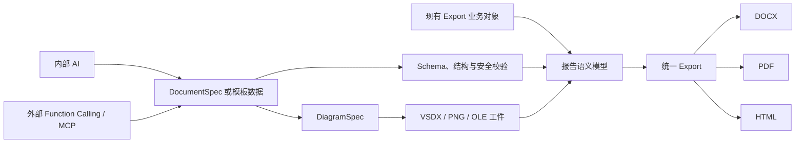

# Omni Office 功能总览与针对性示例

本文面向业务开发、AI 应用开发和平台接入人员，说明 Omni Office 当前已经实现的能力、各入口的适用边界，
以及可以直接参考或运行的示例。

## 1. 项目定位

Omni Office 不是单一的 Word 工具类，而是一套统一的结构化文档生成平台。它支持三类主要输入：

- 现有 Java 业务对象和强类型报告模块。
- 内部 AI 生成的 DocumentSpec 或模板业务数据。
- 外部 AI 通过 Function Calling/MCP 提交的受控结构化数据。

所有入口最终都进入统一的校验与导出链路：



## 2. 如何选择入口

| 使用场景 | 推荐入口 | 选择原因 |
| --- | --- | --- |
| 已有复杂业务报告 | Export + Module | 支持强类型数据、业务计算、条件和模块依赖 |
| 调用方自由定义文档结构 | DocumentSpec | 无需预定义业务章节，使用统一 JSON 描述文档 |
| 固定报告结构、只填数据 | DocumentTemplate | 模板控制结构，调用方或 AI 只填写 Schema 允许的数据 |
| 内部 AI 自由编排章节 | Internal AI + DocumentSpec | AI 可以定义章节和内容，结果仍需严格校验 |
| 内部 AI 填写固定报告 | Internal AI + DocumentTemplate | AI 不能改变模板结构，稳定性更高 |
| 外部 AI 接入 | Function Calling/MCP | 对外提供稳定工具名、参数 Schema 和受控工件 URI |
| 流程图、ER 图、Visio | DiagramSpec | 同源生成 SVG/PNG/VSDX，并可嵌入 Word |
| 生产异步生成 | Generation Job REST API | 支持幂等、审核、取消、恢复、Webhook 和生命周期治理 |

## 3. 强类型业务报告 Export

强类型 Export 适合已有 Java 业务对象，需要复杂业务判断和模块组合的报告。每个 Module 拥有自己的数据类型、
模块编码和内容组装逻辑。

```java
ComposableReportModuleModel modules = ComposableReportModuleModel.builder()
        .module(new AssessmentScenarioConstructionModuleData(
                "根据任务目标构设评估场景。"))
        .module(new ImpactAnalysisModuleData(
                "分析关键因素对任务结果的影响。"))
        .module(new FunctionalOptimizationAnalysisModuleData(
                "提出功能优化建议。"))
        .build();

ComposableReportInput input = ComposableReportInput.builder(modules)
        .preparedBy("评估分析组")
        .build();

new ComposableTextReportExporter().export(
        input,
        Path.of("target", "assessment-report.docx"));
```

模块添加顺序就是正文顺序。启用目录时，框架不会在目录与第一个 Module 之间插入报告标题、基础信息表或
其他前导内容；首个正文元素及其样式由 Module 控制。

参考实现：

- [`AssessmentReportExportExample`](../src/main/java/cn/bugstack/export/example/AssessmentReportExportExample.java)
- [`ComposableTextReportExportExample`](../src/main/java/cn/bugstack/export/example/composable/ComposableTextReportExportExample.java)

## 4. DocumentSpec 动态文档

DocumentSpec 适合不预定义业务章节，由调用方或 AI 自由描述章节、段落、表格和图形的场景。

```json
{
  "schemaVersion": "1.0",
  "metadata": {
    "title": "系统评估报告",
    "author": "评估分析组"
  },
  "layout": {
    "bodyTitleEnabled": false,
    "tableOfContentsDepth": 3
  },
  "cover": {
    "documentName": "系统评估报告",
    "projectName": "Omni Office",
    "version": "V1.0"
  },
  "sections": [
    {
      "title": "评估概述",
      "blocks": [
        {
          "type": "paragraph",
          "textRanges": [
            {
              "text": "评估结论：",
              "style": {
                "bold": true,
                "fontColor": "#C00000"
              }
            },
            {
              "text": "当前系统满足交付要求。"
            }
          ]
        },
        {
          "type": "table",
          "headers": ["模块", "状态"],
          "rows": [
            ["文档生成", "正常"],
            ["图形生成", "正常"]
          ],
          "columnWidths": [2, 1],
          "alignment": "CENTER",
          "caption": "能力检查结果",
          "captionPosition": "ABOVE"
        }
      ]
    }
  ]
}
```

Java 导出：

```java
DocumentSpec spec = codec.read(documentSpecJson);
DefaultDynamicDocumentExporter exporter = new DefaultDynamicDocumentExporter();

byte[] docx = exporter.exportToBytes(spec, ReportOutputFormat.DOCX);
byte[] pdf = exporter.exportToBytes(spec, ReportOutputFormat.PDF);
byte[] html = exporter.exportToBytes(spec, ReportOutputFormat.HTML);
```

DocumentSpec 当前支持：

- 封面、修订记录、审批页、目录和页面设置。
- 段落、多个 TextRange，以及每个范围的独立样式。
- 字体、字号、颜色、粗体、斜体和下划线。
- 列表、子章节和分页符。
- 图片、DiagramSpec、Visio 和题注。
- 页面宽度自适应表格、比例列宽、对齐和合并。
- DOCX、PDF 和单文件 HTML 输出。

完整示例：[`example-complete.json`](../src/main/resources/document-spec/1.0/example-complete.json)

## 5. 字体、富文本和表格

内置默认字体区分中文与英文数字：

| 区域 | 中文默认字体 | 英文和数字默认字体 | 其他默认值 |
| --- | --- | --- | --- |
| 表格内容 | 宋体 | Times New Roman | 黑色、常规 |
| 表头 | 黑体 | Times New Roman | 黑色、不加粗 |

以上只是默认样式，不是渲染器固定值。业务可以按报告、表格或 TextRange 动态覆盖。

```java
section.table("模块", "版本")
        .headerTextStyle(style -> style
                .farEastFontFamily("微软雅黑")
                .asciiFontFamily("Arial")
                .bold(false))
        .bodyTextStyle(style -> style
                .farEastFontFamily("仿宋")
                .asciiFontFamily("Calibri"))
        .row("DocumentSpec", "1.0")
        .end();
```

表格还支持：

- 默认占满页面正文可用宽度。
- `columnWidths` 按比例分配列宽。
- 单元格文字默认水平、垂直居中。
- 表格左对齐、居中和右对齐。
- 横向合并、纵向合并和矩形合并。
- 表头样式与表内容样式分别配置。
- 题注位于表格上方或下方。

完整示例：
[`FormattingCapabilitiesReportExportExample`](../src/main/java/cn/bugstack/export/example/FormattingCapabilitiesReportExportExample.java)

## 6. DocumentTemplate 模板化生成

DocumentTemplate 适合文档结构固定、调用方只填写业务数据的场景。

```java
DocumentTemplateApplication templates = new DocumentTemplateApplication();
templates.register(getClass().getResourceAsStream(
        "/document-template/1.0/example-assessment-template.json"));

byte[] docx = templates.exportToBytes(
        "system.assessment",
        "1.0.0",
        businessDataJson,
        ReportOutputFormat.DOCX);
```

模板能力包括：

- JSON Schema draft 2020-12 业务数据校验。
- `{{project.name}}` 标量占位符。
- `$each` 循环生成列表项、表格行或文档块。
- `$if` 条件生成。
- 模板精确版本选择，不隐式选择最新版。
- 草稿、审核、批准、拒绝、发布和退役。
- 发布前使用代表性数据执行真实 DOCX 渲染门禁。
- Schema 兼容性比较。

现有 Export 与 DocumentTemplate 不会互相回退：复杂业务计算继续由 Export 负责，模板只负责数据校验和
受限结构映射。

模板示例：
[`example-assessment-template.json`](../src/main/resources/document-template/1.0/example-assessment-template.json)

## 7. 内部 AI 生成

内部 AI 提供两个独立入口。

### 7.1 自由模式

AI 输出完整 DocumentSpec，可以定义章节和内容。

```java
InternalAiDocumentApplication ai =
        new InternalAiDocumentApplication(structuredAiClient);

AiDocumentResult result = ai.generateFreeform(
        "生成包含概述、能力分析和风险结论的系统评估报告",
        contextJson);

byte[] docx = ai.exportToBytes(result, ReportOutputFormat.DOCX);
```

### 7.2 模板模式

AI 只填写模板 Schema 允许的业务数据，不能修改章节结构。

```java
ai.registerTemplate(getClass().getResourceAsStream(
        "/document-template/1.0/example-assessment-template.json"));

AiDocumentResult result = ai.generateFromTemplate(
        "system.assessment",
        "1.0.0",
        "根据上下文填写系统评估数据",
        contextJson);
```

两种模式不会相互回退。模型输出必须通过 JSON 解析、Schema 校验、DocumentSpec 校验和 AI 安全校验，
失败时执行有界校正重试。

对于本地 `qwen3.5:2b`，优先推荐模板模式。小模型只填写受控字段，通常比自由生成完整 DocumentSpec 更稳定。

本地模型示例：
[`OllamaAiDocumentExample`](../src/main/java/cn/bugstack/application/ai/ollama/OllamaAiDocumentExample.java)

## 8. Function Calling 与 MCP

外部 AI 不直接访问内部模型或服务器文件路径，而是调用统一的 `ExternalDocumentToolApplication`。

| 工具 | 用途 |
| --- | --- |
| `omni_templates_list` | 查询可用模板及精确版本 |
| `omni_template_schema` | 获取模板业务数据 Schema |
| `omni_template_export` | 按模板数据生成文档 |
| `omni_document_export` | 按 DocumentSpec 生成文档 |
| `omni_diagram_generate` | 生成 VSDX 与 PNG 图工件 |
| `omni_asset_store` | 保存受控 PNG/JPEG 并返回 Asset ID |
| `omni_asset_get` | 查询当前主体的图片资产 |
| `omni_asset_delete` | 删除当前主体的图片资产 |

Function Calling 示例：

```java
ExternalDocumentToolApplication application =
        new ExternalDocumentToolApplication(
                Path.of("target", "external-artifacts"));

FunctionCallingDocumentAdapter functions =
        new FunctionCallingDocumentAdapter(application);

String toolDefinitions = functions.listFunctionToolsJson();
String result = functions.invoke(
        "omni_template_export",
        argumentsJson);
```

固定模板的推荐调用链：

```text
omni_templates_list
        ↓
omni_template_schema
        ↓
外部 AI 按 Schema 填写业务数据
        ↓
omni_template_export
        ↓
omni-office://artifacts/{uuid}
```

所有生成结果都通过受控 `resourceUri` 暴露。外部调用方不能指定输出路径，图片和图工件也必须使用
`assetId` 或 `diagramArtifactId`。

## 9. DiagramSpec、Visio 和图形

当前支持 SVG 用例图、流程图、ER 图、系统 ER 图、PNG 预览和可编辑 VSDX。

```java
DiagramArtifactReference artifact =
        generationApplication.generateDiagram(diagramSpec);

diagramBlock.setDiagramArtifactId(
        artifact.getDiagramArtifactId());

diagramBlock.setEmbedMode("EDITABLE_VISIO");
```

嵌入方式：

- `EDITABLE_VISIO`：在 Word 中嵌入可以双击编辑的 Visio OLE 对象。
- `PREVIEW_IMAGE`：只写入 PNG，适用于 PDF 或不需要编辑的交付文档。

参考示例：

- [`EditableVisioWordExample`](../src/main/java/cn/bugstack/office/docx/example/EditableVisioWordExample.java)
- [`SvgDiagramExample`](../src/main/java/cn/bugstack/office/diagram/example/SvgDiagramExample.java)

## 10. 生产服务与治理

当前生产化能力包括：

- MCP stdio 和 Streamable HTTP。
- API Key、JWT、OIDC Discovery/JWKS。
- Origin、限流、超时、会话隔离和多租户隔离。
- Generation Job 异步生成、幂等、取消、恢复和任务超时。
- AI 草稿四眼审核。
- Webhook Outbox、HMAC 签名、重试和死信重投。
- 本地存储、S3 和 MinIO 对象存储适配。
- OOXML 安全扫描、敏感信息扫描和可选 ClamAV。
- 健康检查、Prometheus 指标和租户运维汇总。
- PostgreSQL 多实例租约；数据库结构由人工维护，不使用 Flyway。

异步 AI 任务请求示例：

```json
{
  "mode": "AI_FREEFORM",
  "outputFormat": "DOCX",
  "reviewPolicy": "REQUIRED",
  "instruction": "生成一份系统评估报告",
  "context": {
    "systemName": "Omni Office"
  }
}
```

请求提交到 `POST /v1/generation-jobs`。当任务进入 `PENDING_REVIEW` 后，必须由不同于提交人的审批人批准，
然后使用已经冻结的 DocumentSpec 继续确定性渲染，不会再次调用模型。

REST 契约：[`openapi.json`](../src/main/resources/omni-service/1.0/openapi.json)

## 11. 直接运行示例

使用项目指定的 Maven：

```bash
/Users/luojiang/maven/apache-maven-3.6.3/bin/mvn \
  -q -Dtest=AssessmentReportExportExampleTest test
```

输出：`target/assessment-report-example.docx`

运行富文本、字体、表格、合并和题注示例：

```bash
/Users/luojiang/maven/apache-maven-3.6.3/bin/mvn \
  -q -Dtest=FormattingCapabilitiesReportExportExampleTest test
```

输出：`target/formatting-capabilities-report-example.docx`

运行完整测试：

```bash
/Users/luojiang/maven/apache-maven-3.6.3/bin/mvn test
```

## 12. 当前边界

- Aspose JAR 使用本地 `systemPath`，不会提交到公共仓库。
- Aspose License 通过外部文件加载，不应打入代码库或镜像。
- Word 目录和页码是动态域，阅读器首次打开时可能重新计算。
- PDF/HTML 的中文排版依赖运行环境中的中文字体。
- 内置 HTTP 服务当前不提供服务端 SSE 消息流。
- ClamAV 只有配置真实扫描命令后才视为启用。
- PostgreSQL 模式只连接既有表结构，不负责数据库迁移。

## 13. 推荐落地顺序

1. 现有复杂业务继续使用 Export + Module，不改造为模板。
2. 结构固定的新业务优先定义 DocumentTemplate 和数据 Schema。
3. 自由文档或 AI 自主编排使用 DocumentSpec。
4. 外部 AI 统一通过 Function Calling/MCP，不直接调用内部 Export 类。
5. 流程图和 Visio 统一使用 DiagramSpec 和受控工件 ID。
6. 长耗时或生产调用使用 Generation Job REST API。
